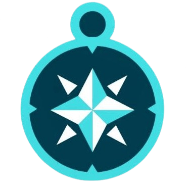
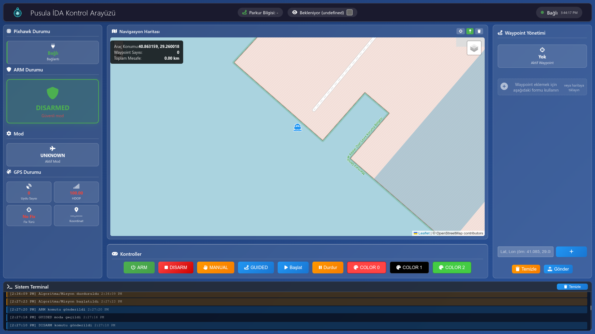
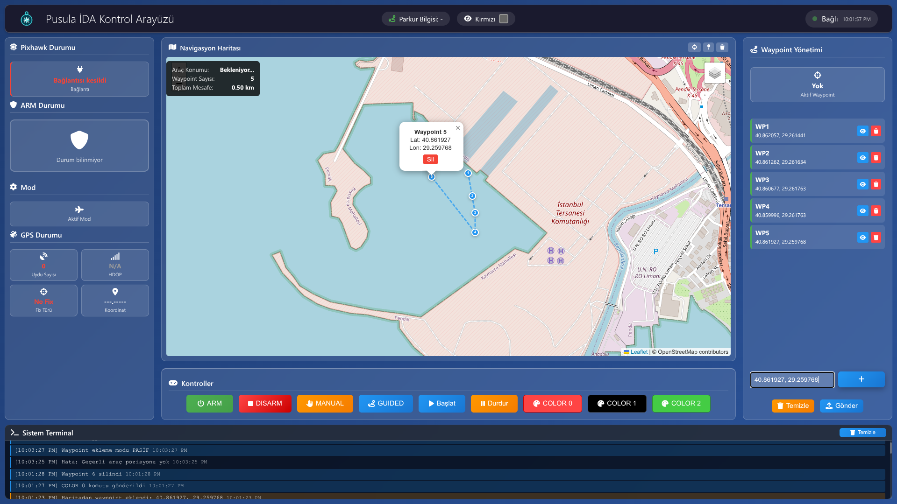
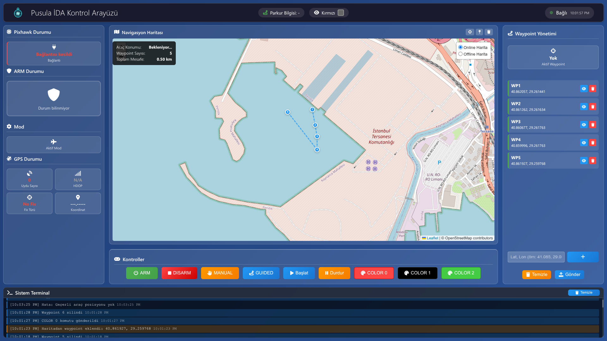

  
  <h1>Pusula Ground Control Station (GCS)</h1>

## 📋 Overview

Pusula Ground Control Interface (GCS) is a custom-built software that enables real-time communication with our unmanned surface vehicle (USV). Through telemetry, it allows us to both send commands and receive live data from the Pixhawk Cube Orange Plus flight controller. The interface displays real-time system information and vehicle status, including location, orientation, and sensor data. With integrated mapping functionality, users can monitor the vehicle’s live position and visualize assigned waypoints on the map, ensuring better mission awareness and control.

## 🛠️ Technical Stack

### Backend

  
  
  
  

### Frontend

  
  
  
  

## 🖥️ Core Features

- **Real-time Telemetry** - Monitor vehicle status, GPS, battery, and sensor data
- **Mission Planning** - Create and manage waypoint-based missions
- **Command Interface** - Direct control and command input
- **Map Integration** - Real-time vehicle tracking on interactive maps
- **Data Logging** - Record and analyze mission data
- **Multi-vehicle Support** - Control multiple USVs from a single interface

## 🖼️ Visual

  
  
<em>Figure 1: Pusula GCS Dashboard Interface</em>

  
  
  
<em>Figure 2: Waypoint Management Interface</em>

  
  
  
<em>Figure 3: Mission Planning with Multiple Waypoints</em>

## 👥 Developers

- [Ali Haydar Sucu](https://github.com/alihaydarsucu)
- [Abdullah Aksoy](https://github.com/abdullah-aksoy)

## Features

### Dashboard Features

- 🎛️ **Real-time USV monitoring** - ARM status, flight mode, GPS, battery, failsafes
- 🗺️ **Interactive map** with vehicle position and waypoint management
- 💻 **Terminal interface** for direct command input
- 🎨 **Color detection display** - Shows "Renk Bekleniyor" for İHA color detection
- 📊 **System status panels** with telemetry data
- 🚀 **Mission control** - Start/stop algorithms, mode switching

### YKI Integration

- ✅ **Command translation** - Dashboard commands mapped to YKI macros
- 🔄 **Status polling** - Regular telemetry updates from YKI backend
- 📡 **Serial communication** - Direct interface with Pixhawk via YKI
- 🛡️ **Error handling** - Graceful handling of connection issues

## Usage

### Command Interface

The dashboard terminal accepts all YKI commands and macros:

**Basic Commands:**

- `STATUS` - Get telemetry data
- `ARM` / `ARM MANUAL` - Arm the vehicle safely
- `DISARM` - Disarm the vehicle
- `MODE MANUAL` - Switch to manual mode
- `MODE GUIDED` - Switch to guided mode

**Algorithm Commands:**

- `ALGO BASLA` - Start algorithm/mission
- `ALGO DUR` - Stop algorithm/mission
- `ALGO HAREKETLEN` - Algorithm movement command

**Navigation Commands:**

- `GOTO lat lon alt` - Navigate to coordinates
- `RC TEST` - Test RC channels
- `MOTOR_TEST` - Test motors

### Waypoint Management

1. Click on map to add waypoints
2. Use "Gönder" button to upload waypoints to YKI
3. Waypoints are converted to `GOTO` commands automatically

### Color Detection

The "Renk Bekleniyor" section is preserved for future İHA color detection integration. When implemented, it will display:

- Detected color (Kırmızı/Yeşil/Siyah)
- Color code
- Real-time updates

## Competition Requirements

This integration supports the İnsansız Deniz Aracı (USV) competition requirements:

- ✅ **YKI (Ground Control Station)** - Web-based dashboard
- ✅ **Command Interface** - Terminal and button controls
- ✅ **Telemetry Display** - Real-time status monitoring
- ✅ **Mission Control** - Algorithm start/stop functionality
- ✅ **Navigation** - Waypoint management and GPS display
- ✅ **Safety Features** - ARM/DISARM controls and failsafe monitoring
- ✅ **Color Detection Ready** - UI prepared for İHA integration

## License

This project integrates with the existing YKI system and maintains compatibility with the original architecture while providing a modern web interface for USV control and monitoring.
